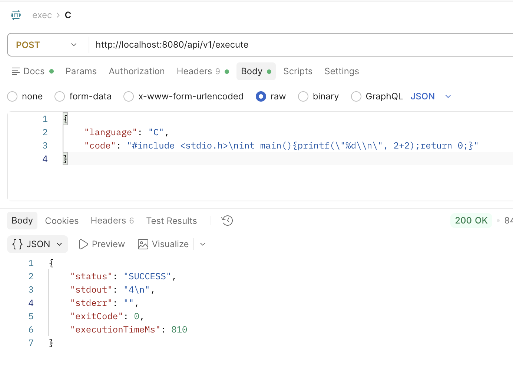
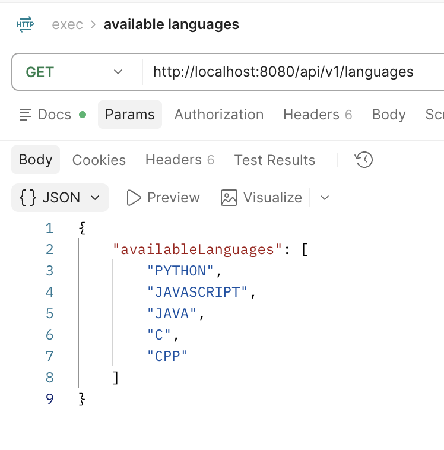

# exec

A code execution API that runs untrusted code securely inside isolated Docker containers.

## Languages

Python, JavaScript, Java, C, C++

## Run it

Needs Java 21 and Docker.

```
./mvnw spring-boot:run
```

Or in Docker:

```
docker compose up --build
```

App runs on `http://localhost:8080`.

## Use it

**Run code**

```
curl -X POST http://localhost:8080/api/v1/execute \
  -H "Content-Type: application/json" \
  -d '{"language":"PYTHON","code":"print(\"Hello\")"}'
```

```json
{ "status": "SUCCESS", "stdout": "Hello\n", "stderr": "", "exitCode": 0, "executionTimeMs": 412 }
```

- `language`: `PYTHON`, `JAVASCRIPT`, `JAVA`, `C` or `CPP`
- `code`: your program
- `stdin`: input for your program (optional)

`status` is `SUCCESS`, `ERROR` or `TIMEOUT`.



**List languages**

```
curl http://localhost:8080/api/v1/languages
```



## Safe by default

Each run gets its own Docker container:

- No internet
- 10 seconds max
- 256 MB memory
- 1 MB output max
- Can't change your files

## Test

```
./mvnw test
```

## Docs

In `docs/`: product definition, design, implementation plan, test cases.
